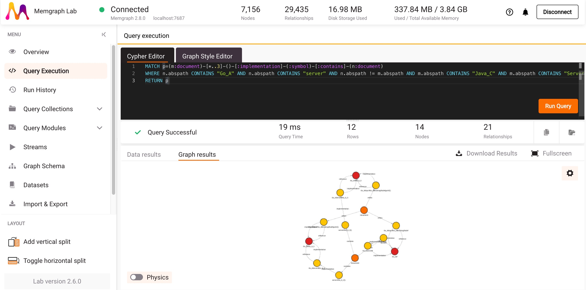

# RPCoverBenchmark

This repository serves as a benchmark for `proto-gen-scip`, a protoc plugin. The plugin generates the SCIP index file, which can be used to analyze the dependencies between codes, and even between services.

The `proto-gen-scip` can be found in [https://github.com/CUHK-SE-Group/protoc-gen-scip](https://github.com/CUHK-SE-Group/protoc-gen-scip)

## Project Layout

```
├── Cpp_A                   // cpp service a
├── Cpp_B                   // cpp service b
├── Cpp_C                   // cpp service c
├── Go_A                    // go service a
├── Go_B                    // go service b
├── Go_C                    // go service c
├── Java_A                  // java service a
├── Java_B                  // java service b
├── Java_C                  // java service c
├── Python_A                // python service a
├── Python_B                // python service b
├── Python_C                // python service c
├── Ts_A                    // typescript service a
├── Ts_B                    // typescript service b
├── Ts_C                    // typescript service c
├── protos                  // the protos we used
├── third_party             // third party binaries
├── hotelReservation        // DeathStarBench's hotelReservation service
├── README.md
├── requirements.txt        // python dependencies
├── scip.proto              // proto related with scip, copied from https://github.com/sourcegraph/scip/blob/main/scip.proto
├── bench.py                // the python scripts that to reproduce experiment results.
├── generate.sh             // the script that generate the gRPC code
├── docker-compose.yaml     
├── Dockerfile
├── Makefile
├── package.json
└── package-lock.json
```

## Call Dependencies

The following table shows the service/function level dependencies(calls).

A function is named [Language]-[Svc Name]-[Function#]. 

Take the first function as an example, it is named as `python-A-1`. If a function calls another function, whether it is a direct function call or a remote procedure call, it will be considered as a dependent service. Taking the first line in the table as an example, it indicates that `python-A-1` will call `python-A-2`, `python-B-1`, and `python-C-1`.

| Language     | Svc Name | Function# | Dependent Services Function ID                            |
|--------------|----------|-----------|-----------------------------------------------------------|
| Python       | A        | 1         | python-A-2, python-B-1, python-C-1                         |
|              |          | 2         | python-B-2, python-C-2, java-A-1                           |
|              |          | 3         | python-B-1, python-B-3, java-A-2                           |
| Python       | B        | 1         | python-C-1, python-C-2, python-C-3                         |
|              |          | 2         | python-C-3, python-C-2, java-A-3                           |
|              |          | 3         | python-B-1, python-C-1, python-B-2                         |
| Python       | C        | 1         | python-C-2, python-C-3, java-B-1                           |
|              |          | 2         | python-C-3, java-B-2, java-B-1                             |
|              |          | 3         | python-C-1, java-B-3, java-B-2                             |
| Java         | A        | 1         | java-A-2, java-A-3, java-C-1                               |
|              |          | 2         | java-B-1, java-B-2, java-A-3                               |
|              |          | 3         | java-B-2, java-B-3, ts-A-1, cpp-A-1, go-A-1                 |
| Java         | B        | 1         | java-B-3, ts-A-1, cpp-A-1, go-A-1                          |
|              |          | 2         | java-B-3, ts-A-2, cpp-A-2, go-A-2, java-C-1, java-C-2       |
|              |          | 3         | java-C-1, java-C-3, java-C-2, go-A-3, go-A-2, cpp-A-2       |
| Java         | C        | 1         | cpp-A-3, cpp-B-3, java-C-2, java-C-3, go-A-3, go-B-2, ts-A-3, ts-B-2 |
|              |          | 2         | cpp-A-2, cpp-B-2, java-C-3, ts-C-3, go-A-2, go-B-3, ts-B-3, ts-C-2 |
|              |          | 3         | cpp-A-1, cpp-B-1, go-B-1, go-C-2, ts-B-1, ts-A-2             |
| Go           | A        | 1         | go-A-2, go-A-3, go-B-1, cpp-B-3, cpp-C-2, ts-B-1, ts-B-3, ts-C-2 |
|              |          | 2         | go-C-1, go-C-2, go-B-3, java-A-1, ts-C-1                     |
|              |          | 3         | go-B-2, go-A-2, go-C-3, java-B-2, cpp-C-3, cpp-C-2           |
| Go           | B        | 1         | go-C-3, go-B-2, go-C-2, go-C-1, ts-B-1, ts-C-2               |
|              |          | 2         | go-C-1, go-B-3, go-C-3, java-C-3, cpp-A-3                     |
|              |          | 3         | go-C-3, ts-A-2, ts-B-1, ts-A-3, cpp-B-2                       |
| Go           | C        | 1         | go-C-2, go-C-3, python-C-2, java-B-2                         |
|              |          | 2         | cpp-B-2, ts-C-3                                               |
|              |          | 3         |                                                               |
| C++          | A        | 1         | cpp-B-2, cpp-A-2, python-B-2, java-B-2                       |
|              |          | 2         | ts-B-1, ts-B-2, cpp-B-3                                       |
|              |          | 3         | ts-A-2, cpp-B-2, cpp-B-1                                       |
| C++          | B        | 1         | cpp-B-3, cpp-C-1, cpp-C-2                                     |
|              |          | 2         | cpp-C-1, cpp-B-3, java-B-2                                     |
|              |          | 3         | cpp-C-3, cpp-C-2                                               |
| C++          | C        | 1         | cpp-B-3, cpp-C-3, cpp-B-1                                     |
|              |          | 2         | cpp-C-3, ts-A-2                                               |
|              |          | 3         | java-B-3, ts-C-3                                               |
| Typescript   | A        | 1         | ts-A-2, ts-B-3, ts-C-2, cpp-A-2                               |
|              |          | 2         | ts-A-3, cpp-B-2, java-C-2                                      |
|              |          | 3         | ts-A-1, ts-B-3, ts-C-3                                         |
| Typescript   | B        | 1         | python-A-2, java-B-2                                           |
|              |          | 2         | cpp-A-2, cpp-B-3                                               |
|              |          | 3         | cpp-B-3, java-A-2                                               |
| Typescript   | C        | 1         | go-B-2, go-B-3                                                 |
|              |          | 2         | ts-C-2, java-C-2                                               |
|              |          | 3         | python-B-2                                                     |

## Steps of the benchmark

1. Run the baseline tests --- generate LSIF index files
2. Run the RPCover --- generate SCIP index file, and match the symbols in protobuf and code base.
3. Analyze the graph result

## How to start

There are some dependencies should be installed:

1. scip-clang
2. scip-go
3. scip-java
4. scip-typescript
5. scip-python

We provide a Dockerfile to help reproduce the experiment results. Also, these binaries and corresponding source codes are stored in `third_party` directory.

Run the following commands, then, a shell will be opened.

```bash
docker build -t rpcover:latest .
docker run -it --shm-size 1G --rm rpcover:latest bash # it needs larger shm
```

We have generated the corresponding dependencies, so we just need to operate the `bench.py` to reproduce results.

Before executing commands, the first thing you should do is `make all`, to prepare the test environments

```bash
make all
```

There is a script, and it has several commands that can be used:

```bash
root@9bc3616506c5:/opt/RPCoverBenchmark# python bench.py
Usage: bench.py [OPTIONS] COMMAND [ARGS]...

Options:
  --help  Show this message and exit.

Commands:
  clean                    This command remove the benchmark testing files
  convert                  This command will convert the total.scip file...
  gen-lsif                 This command will generate the baseline lsif...
  gen-merged-scip          This command merge and add relationshiops...
  gen-simple-scip          This command generate the base scip index file...
  performance-merge-every  This command will run every scip index, and...
  performance-merge-once   This command will run the all process 20 times...
```

Next, we will introduce usage of each command.

### Clean

This command is to make sure that there is no legacy files.

```
python bench.py clean
```


### Generating the LSIF index files

In this step, we will generate the baseline LSIF index file using corresponding LSIF indexer.

```bash
root@7d6a299a862d:/opt/RPCoverBenchmark# python bench.py gen-lsif
[8/33] Processing file /opt/RPCoverBenchmark/Cpp_A/protos/Java_B.pb.cc
[9/33] Processing file /opt/RPCoverBenchmark/Cpp_A/protos/message.pb.cc
[10/33] Processing file /opt/RPCoverBenchmark/Cpp_A/protos/Ts_B.pb.cc
```

In this step, `lsif.output.csv` will be produced. It should look like as the following shows. The first column is the **service name**, the second column is the **time used(User Time)**, and the third column is the **peak memory in the generating process(MB)**.

```
root@da2f744fd625:/opt/RPCoverBenchmark# cat lsif.output.csv 
Cpp_A,24.28,1219
Cpp_B,24.16,1189
Cpp_C,24.29,1209
Go_A,5.54,506
Go_B,4.99,534
Go_C,4.7,536
Python_A,5.73,123
Python_B,4.22,122
Python_C,4.3,122
Ts_A,3.51,223
Ts_B,3.58,224
Ts_C,4.13,224
```

### Benchmarking the RPCover

This step will run the `performance-merge-every` 20 times, and get the average time and memory usage of RPCover.


```
root@7d6a299a862d:/opt/RPCoverBenchmark# python bench.py performance-merge-every
+ Ts_A (439ms)
done /opt/RPCoverBenchmark/tsa.scip
        Command being timed: "scip-typescript index Ts_A --output tsa.scip"
        User time (seconds): 2.12
        System time (seconds): 0.08
        Percent of CPU this job got: 226%
        Elapsed (wall clock) time (h:mm:ss or m:ss): 0:00.97
        Average shared text size (kbytes): 0
        Average unshared data size (kbytes): 0
        Average stack size (kbytes): 0
        Average total size (kbytes): 0
        Maximum resident set size (kbytes): 222304
        Average resident set size (kbytes): 0
        Major (requiring I/O) page faults: 3
        Minor (reclaiming a frame) page faults: 52996
        Voluntary context switches: 906
        Involuntary context switches: 145
        Swaps: 0
        File system inputs: 0
        File system outputs: 1264
        Socket messages sent: 0
        Socket messages received: 0
        Signals delivered: 0
        Page size (bytes): 4096
        Exit status: 0

Time: 2.12s, Memory: 222MB
```

In this step, `output.csv` will be produced. The first three column has the some meaning of `lsif.output.csv`. 

The `*_m` row means the time and memory cost of `proto-gen-scip`, the rows without `_m` means the orignal `scip indexer`'s cost. 

Take the first two rows as an example, it takes 2.06s and 223.0MB to generate the original SCIP index. And it takes 0.02s and 19.0MB to generate the merged 

```
root@da2f744fd625:/opt/RPCoverBenchmark# cat output.csv 
Ts_A,2.06,223.0
Ts_A_m,0.02,19.0,0.9708737864077669,8.520179372197308
Ts_B,2.14,218.0
Ts_B_m,0.02,19.0,0.9345794392523363,8.715596330275229
Ts_C,2.1,228.0
Ts_C_m,0.0,19.0,0.0,8.333333333333332
Python_A,4.41,184.0
Python_A_m,0.01,20.0,0.22675736961451248,10.869565217391305
Python_B,4.42,183.0
Python_B_m,0.03,20.0,0.6787330316742082,10.92896174863388
Python_C,4.38,189.0
Python_C_m,0.02,20.0,0.45662100456621013,10.582010582010582
Go_A,3.54,531.0
Go_A_m,0.04,19.0,1.1299435028248588,3.5781544256120528
Go_B,3.57,535.0
Go_B_m,0.04,20.0,1.1204481792717087,3.7383177570093453
Go_C,3.43,553.0
Go_C_m,0.03,19.0,0.8746355685131194,3.4358047016274864
Java_A,22.38,962.0
Java_A_m,0.06,31.0,0.2680965147453083,3.2224532224532227
Java_B,22.53,1025.0
Java_B_m,0.11,29.0,0.48823790501553477,2.829268292682927
Java_C,24.12,1046.0
Java_C_m,0.11,31.0,0.45605306799336653,2.9636711281070744
Cpp_A,49.12,182.0
Cpp_A_m,0.16,41.0,0.32573289902280134,22.52747252747253
Cpp_B,48.55,179.0
Cpp_B_m,0.17,41.0,0.3501544799176108,22.905027932960895
Cpp_C,48.26,182.0
Cpp_C_m,0.17,41.0,0.3522585992540407,22.52747252747253
```
### Generating the orignal SCIP files

After executing the previous steps, we have the baseline data.

In this step will produce scip index of each service in the project root path. 

```bash
$ python bench.py gen-simple-scip
Begin to generate...
Generating Typescript SCIP index...
Attaching to process 1980483
+ Ts_A (556ms)
done /opt/RPCoverBenchmark/tsa.scip
Process finished (1.37 seconds)
Time: 1.369s, Memory: 252.426MB
Attaching to process 1980507
+ Ts_B (547ms)
done /opt/RPCoverBenchmark/tsb.scip
Process finished (1.36 seconds)
Time: 1.358s, Memory: 251.984MB
```

After waiting some minutes, there will be several scip files in the project root path.

```bash
(venv) root@93f13740a588:/opt/RPCoverBenchmark# ls -alh *.scip
-rw-r--r-- 1 root root 4.3M Jul 17 06:45 cppa.scip
-rw-r--r-- 1 root root 4.3M Jul 17 06:45 cppb.scip
-rw-r--r-- 1 root root 4.3M Jul 17 06:45 cppc.scip
-rw-r--r-- 1 root root 506K Jul 17 06:44 goa.scip
-rw-r--r-- 1 root root 504K Jul 17 06:44 gob.scip
-rw-r--r-- 1 root root 486K Jul 17 06:44 goc.scip
-rw-r--r-- 1 root root 1.7M Jul 17 06:42 javaa.scip
-rw-r--r-- 1 root root 1.7M Jul 17 06:43 javab.scip
-rw-r--r-- 1 root root 1.7M Jul 17 06:44 javac.scip
-rw-r--r-- 1 root root 557K Jul 17 06:44 pya.scip
-rw-r--r-- 1 root root 550K Jul 17 06:44 pyb.scip
-rw-r--r-- 1 root root 550K Jul 17 06:44 pyc.scip
-rw-r--r-- 1 root root 769K Jul 17 06:40 tsa.scip
-rw-r--r-- 1 root root 767K Jul 17 06:40 tsb.scip
-rw-r--r-- 1 root root 763K Jul 17 06:40 tsc.scip
```


### Merge all the scip files and the proto files into one scip index

In this step, you can get the merged `total.scip` file together with the relationship between protobuf and generated code. The `total.scip` is merged from all the scip file generated in previous step.


```bash
(venv) root@93f13740a588:/opt/RPCoverBenchmark# python bench.py gen-merged-scip
Generating merged SCIP index...
Attaching to process 30580
[libprotobuf ERROR google/protobuf/wire_format_lite.cc:618] String field 'google.protobuf.compiler.CodeGeneratorResponse.File.content' contains invalid UTF-8 data when parsing a protocol buffer. Use the 'bytes' type if you intend to send raw bytes.
Process finished (0.12 seconds)
Time: 0.119s, Memory: 17.918MB
Done!
```

In this benchmark, the generated file size is around 2.9MB

```bash
(venv) root@93f13740a588:/opt/RPCoverBenchmark# ls -alh total.scip
-rw-r--r-- 1 root root 2.9M Jul 17 08:02 total.scip
```

Or in anther way, you can maually input this command in the repository root path to get the corresponding merge file.

```bash
/usr/bin/time -v protoc --scip_out=./ --plugin=/opt/third_party/binaries/protoc-gen-scip --scip_opt=scip_dir=./,sourceroot=$(pwd),out_file=total.scip -I . $(find . -name "*.proto")
```

- `/usr/bin/time -v`, a tool that can measure the memory and time usage of a command
- `protoc`, the compiler of the protobuf
- `--scip_out=.`, specify the output dir of the scip index file
- ` --plugin=/opt/third_party/binaries/protoc-gen-scip`, specify the plugin it use
- `--scip_opt=scip_dir=./,sourceroot=$(pwd),out_file=total.scip`, specify the path of scip indexes to be merged, the sourcerooot, and the output file name.
- `-I .`, specify the proto files' root path
- `$(find . -name "*.proto")`, match all the protobuf files in current path.

## Transform the scip file into lsif

To transform scip file into lsif file, you can type `tool convert2lsif --from total.scip`, where `total.scip` is the file that we generated in the previous step.

```bash
(venv) root@93f13740a588:/opt/RPCoverBenchmark# tool convert2lsif --from total.scip
Attaching to process 30604
Process finished (0.19 seconds)
Time: 0.194s, Memory: 176.023MB
```

Then, the default file `dump.lsif` will be output in the project root path. It is stored in json format. We can take a look into it, each line in this file is a vertex or an edge described in json format.

This lsif file can be used for further integration of editor or code analyzer.
```bash
(venv) root@93f13740a588:/opt/RPCoverBenchmark# head dump.lsif
{"id":1,"version":"0.4.3","projectRoot":"file:///opt/RPCoverBenchmark","positionEncoding":"utf-8","toolInfo":{"name":"scip-clang","version":"0.2.2"},"type":"vertex","label":"metaData"}
{"id":2,"type":"vertex","label":"definitionResult"}
{"id":3,"type":"vertex","label":"resultSet"}
{"id":4,"type":"vertex","label":"referenceResult"}
{"id":5,"type":"vertex","label":"hoverResult","result":{"contents":{"kind":"markdown"}}}
{"id":6,"type":"edge","label":"textDocument/definition","inV":2,"outV":3}
{"id":7,"type":"edge","label":"textDocument/references","inV":4,"outV":3}
{"id":8,"type":"edge","label":"textDocument/hover","inV":5,"outV":3}
{"id":9,"type":"vertex","label":"moniker","identifier":"scip-proto proto protos proto3 proto/Java_C/Java_C#","kind":"export","scheme":"scip-proto"}
{"id":10,"type":"edge","label":"moniker","inV":9,"outV":3}
```


### Transform the scip file into cypherl

Cypher is the query language in some popular graph databases. This command allows users to transform the index file into graph create clauses, so that users can use graph database to analyze the code dependencies.

```
tool convert2cypher --from total.scip
```

It will generate `memgraph.out` file, it contains the cypher queries that create the graph. It should look like:

```
CREATE (:document{abspath:"file:/Users/lincyaw/RPCoverBenchmark/Go_A/cmd/client.go", relpath:"cmd/client.go", lang:"go"});
CREATE (:symbol{name:"", fullname:"scip-go gomod Go_A cb6b82253d24 Go_A/cmd/", docrelpath:"cmd/client.go"});
MATCH (n0 {relpath:"cmd/client.go"}), (n1 {fullname:"scip-go gomod Go_A cb6b82253d24 Go_A/cmd/", docrelpath:"cmd/client.go"}) MERGE(n0)-[:contains]->(n1);
```

After getting the cypherl file, you can put this file into Memgraph, or other graph databases to analyze it.

In this repository, we provide a `docker-compose.yaml` to help you start the memgraph instance.

```bash
docker compose up memgraph -d
```

Then you can visit `http://localhost:3333` to check the website of Memgraph.

You can click the `Import & Export` button in the side bar, and upload the file we generated. Note that you may need to change the file name with a postfix `.cypherl`.

After loading the database, you can input our example query to get the relationship bewteen `Go_A` and `Java_C` service.

```cypher
MATCH p=(m:document)-[*..3]-()-[:implementation]-(:symbol)-[:contains]-(n:document)
WHERE n.abspath CONTAINS "Go_A" AND n.abspath CONTAINS "server" AND n.abspath != m.abspath AND m.abspath CONTAINS "Java_C" AND m.abspath CONTAINS "Server"
RETURN p
```



